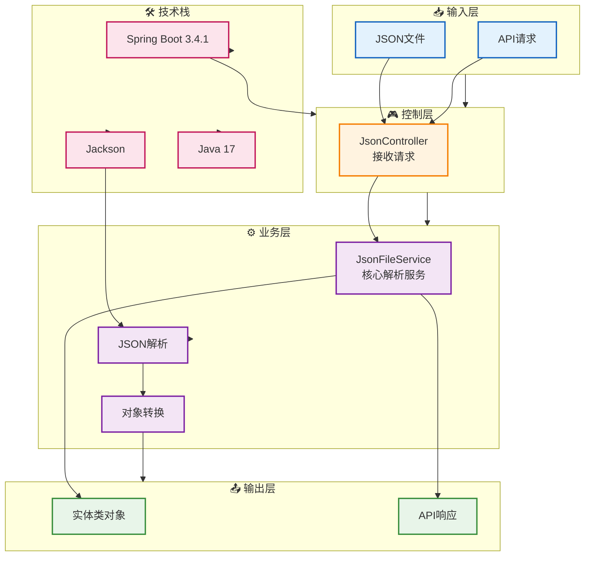
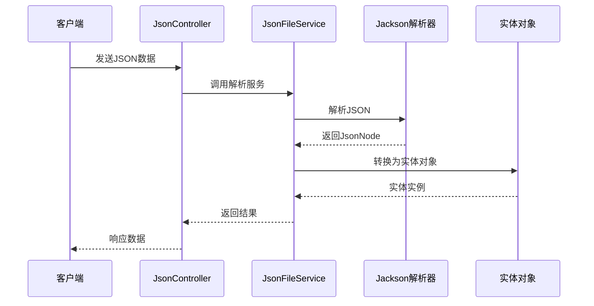

# 🔧 demo-analysisJsonToObject - JSON自动解析工具

## 📖 项目简介

demo-analysisJsonToObject是一个全自动JSON解析工具,能够将JSON数据自动解析并转换为Java实体类对象。支持从文件、API请求等多种数据源读取JSON,并提供灵活的解析配置。

## 🎯 核心功能

- **自动解析**: 将JSON字符串自动转换为Java实体对象
- **多数据源支持**: 支持JSON文件、API请求、字符串输入
- **类型推断**: 自动推断JSON字段类型,生成对应的Java类型
- **嵌套对象支持**: 支持多层嵌套JSON结构的解析
- **批量处理**: 支持批量JSON文件的解析和转换

## 📝 项目来源

本项目为个人学习项目,用于演示Spring Boot中Jackson库的JSON解析功能

## 📊 项目架构

## 🔄 核心流程

