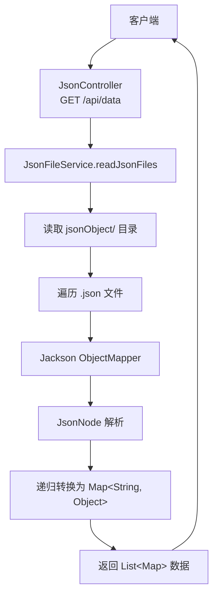

# SPEC.md - demo-analysisJsonToObject

## 1. 项目概述

- **项目名称**: demo-analysisJsonToObject
- **项目类型**: Spring Boot REST API 项目
- **核心功能**: 基于 Jackson 库的 JSON 文件解析工具，将 JSON 文件自动解析并转换为 Java Map 对象
- **目标用户**: 需要进行 JSON 数据解析的 Java 开发者

## 2. 技术栈

| 组件 | 版本 |
|------|------|
| Spring Boot | 3.4.4 |
| Java | 25 |
| Lombok | 1.18.40 |
| Jackson | 由 Spring Boot 管理 |

## 3. 功能规格

### 3.1 核心功能

- **JSON 文件读取**: 读取指定目录下的所有 .json 文件
- **JSON 解析**: 使用 Jackson ObjectMapper 将 JSON 解析为 JsonNode
- **对象转换**: 将 JsonNode 递归转换为 Map<String, Object>
- **REST API**: 提供 `/api/data` 接口返回解析结果

### 3.2 API 接口

| 接口 | 方法 | 路径 | 说明 |
|------|------|------|------|
| 获取数据 | GET | /api/data | 读取 jsonObject 目录下的所有 JSON 文件并返回 |

### 3.3 项目结构

```
src/main/java/wo1261931870/analysisJsonToObject/
├── AnalysisJsonToObjectApplication.java    # Spring Boot 启动类
├── controller/
│   └── JsonController.java                 # REST 控制器
├── service/
│   └── JsonFileService.java                # JSON 文件解析服务
└── jsonObject/                             # JSON 文件存放目录
```

### 3.4 业务逻辑

1. `JsonController` 接收 GET 请求到 `/api/data`
2. 调用 `JsonFileService.readJsonFiles()` 读取 JSON 文件目录
3. `JsonFileService` 遍历目录下的所有 .json 文件
4. 对每个文件使用 Jackson ObjectMapper 解析为 JsonNode
5. 递归遍历 JsonNode，将嵌套对象和数组转换为 Map 结构
6. 返回包含所有 JSON 数据的 List<Map> 列表

## 4. 架构图



## 5. 配置信息

- **Java 版本**: 25
- **编码格式**: UTF-8
- **端口**: 默认 8080 (Spring Boot 默认)

## 6. 升级记录

- **2026-04-23**: 升级到 Spring Boot 3.4.4, Java 25, Lombok 1.18.40
  - 添加 maven-compiler-plugin 注解处理器配置
  - 添加 Lombok 依赖

## 7. 编译信息

- **Maven 编译**: 通过
- **打包方式**: JAR (spring-boot-maven-plugin)
